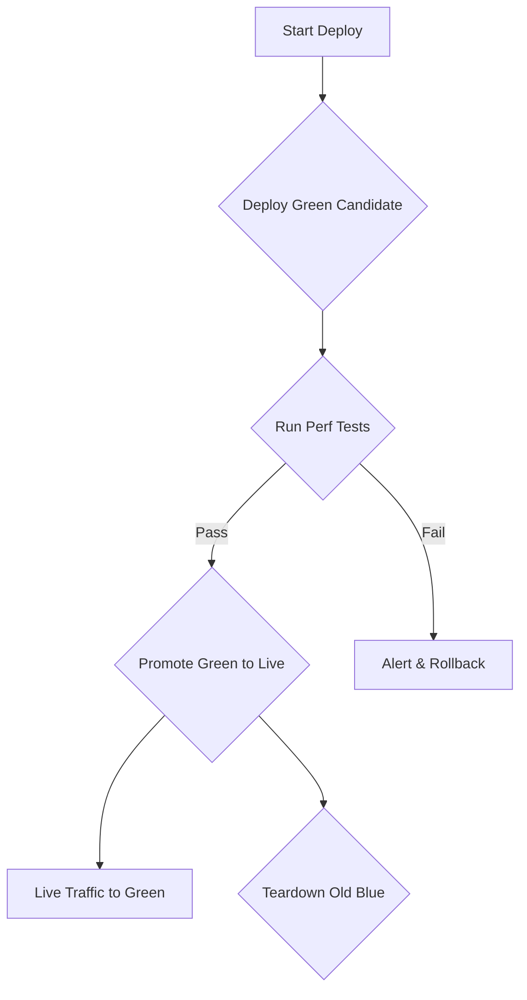

# POC: Blue-Green Deployment Pipeline for Inference

This POC demonstrates the CI/CD pipeline for a zero-downtime, blue-green deployment strategy for a real-time ML inference service.

## Architecture


```